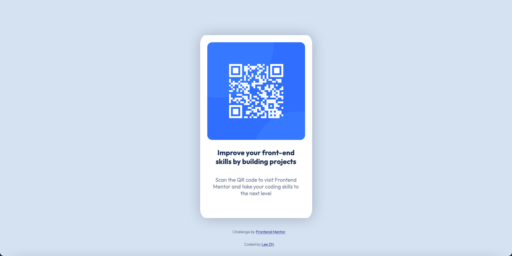

# Frontend Mentor - QR code component solution

This is a solution to the [QR code component challenge on Frontend Mentor](https://www.frontendmentor.io/challenges/qr-code-component-iux_sIO_H). Frontend Mentor challenges help you improve your coding skills by building realistic projects.

## Table of contents

- [Overview](#overview)
  - [Screenshot](#screenshot)
  - [Links](#links)
- [My process](#my-process)
  - [Built with](#built-with)
  - [What I learned](#what-i-learned)
  - [Continued development](#continued-development)
  - [Useful resources](#useful-resources)
- [Author](#author)


## Overview

### Screenshot



### Links

- Solution URL: [Solution](https://github.com/lzhcodes/qr-code-component-main)
- Live Site URL: [Live Site](https://lzhcodes.github.io/qr-code-component-main/)

## My process

### Built with

- CSS custom properties
- Flexbox


### What I learned

Learned how to use Flexbox.

```css
.center {
  display: flex;
  justify-content: center;
  margin-top: 100px;
}
```


### Continued development

I'd like to keep working on ways to display elements. I had some issues with centering elements vertically with Flexbox and had to use a workaround in the end.

### Useful resources

- [CSS Centering Guide](https://css-tricks.com/centering-css-complete-guide/) - I think I tried every single centering method on this list until I found one that semi-worked.


## Author

- Frontend Mentor - [@lzhcodes](https://www.frontendmentor.io/profile/lzhcodes)
